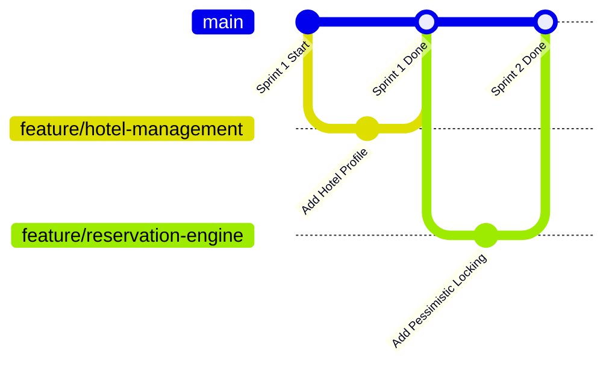

# Contributing to LankaStay Hotels & Resorts

Welcome to the **LankaStay Hotels & Resorts** project repository! This guide establishes our team collaboration workflow, branch naming conventions, and code standards for our **SE2030 Software Engineering** group project at the **Sri Lanka Institute of Information Technology (SLIIT)**.

---

## 1. Project Group Information

- **Course Module:** SE2030 – Software Engineering (Year 2, Semester 1 — 2026)
- **Institution:** Sri Lanka Institute of Information Technology (SLIIT)
- **Project Group:** `Y2-S1-MLB-B1G1-07`

---

## 2. Team Member Module Ownership

Each team member is the primary owner and reviewer for their assigned functional module:

| Student ID | Member Name | Assigned Module | Key Deliverables |
|:---:|---|---|---|
| **IT25102064** | **Wickramasinghe G.D.M.H** | **Destination Management** | Destination CRUD, attraction guides, Leaflet map, image galleries |
| **IT25101220** | **Lakshan H.M.K** | **Search, Reservation & Cancellation** | Date/guest search, availability, pessimistic locking, cancellations |
| **IT25300115** | **Wickramasinghe M.P.T.H** | **Hotel Management** | Hotel profiles, property IDs, policies JSON, media storage |
| **IT25300345** | **Hansani J.A.T.H** | **Room & Amenity Management** | Room catalog, amenities, duplicate room validation, physical units |
| **IT25102219** | **Wickrama W.M.K.E** | **Room Rate & Promotion (Discount)** | Seasonal rates, promotional discount codes, validity, usage limits |
| **IT25103014** | **Weerarathna N.H** | **Review Management** | Completed-stay reviews, ratings breakdown, staff replies, moderation |

---

## 3. Collaborative Agile Workflow

To ensure high code quality across our four development sprints:

1. **Main Branch is Protected:** The `main` branch always represents working, tested, deployable code. Direct commits to `main` without testing are discouraged.
2. **Feature Branching:** Each member works on their feature branch branched off latest `main`:
   - `feature/destination-management`
   - `feature/reservation-engine`
   - `feature/hotel-management`
   - `feature/room-catalog`
   - `feature/rates-promotions`
   - `feature/review-moderation`
3. **Continuous Integration (CI):** Every pull request automatically triggers GitHub Actions to run the full Java test suite and frontend linting before merging.



---

## 4. Branch Naming Conventions

| Branch Type | Format | Example |
|---|---|---|
| **Feature** | `feature/<module-name>` | `feature/destination-catalog` |
| **Backend** | `backend/<feature-name>` | `backend/reservation-locking` |
| **Frontend** | `frontend/<feature-name>` | `frontend/booking-form` |
| **Bug Fix** | `fix/<issue-name>` | `fix/room-quote-calculation` |
| **Documentation** | `docs/<doc-name>` | `docs/readme-update` |
| **Testing** | `test/<test-suite>` | `test/auth-integration` |

---

## 5. Daily Development Routine

### Step 1: Sync with Latest Main
```powershell
git checkout main
git pull origin main
git checkout -b feature/your-feature-name
```

### Step 2: Test Locally Before Committing
Verify that your changes compile and pass tests:
- **Backend:**
  ```powershell
  cd backend
  .\mvnw.cmd test-compile
  .\mvnw.cmd test
  ```
- **Frontend:**
  ```powershell
  cd frontend
  npm run build
  npm run lint
  ```

### Step 3: Secret Hygiene (Crucial)
- **Never commit `.env` files** containing real passwords, database keys, or SMTP tokens.
- All secrets must stay in `.env` (which is included in `.gitignore`).
- If you add new configuration variables, document them in `.env.example`.

### Step 4: Open a Pull Request (PR)
- Push your branch to GitHub: `git push -u origin feature/your-feature-name`
- Open a Pull Request targeting `main`.
- Tag team members for peer review before merging.

---

## 6. Ethical Engineering Standards

In accordance with Section 5 of the design document:
- Never collect unnecessary personal information from users.
- Never hardcode credentials in source code.
- Ensure all business assertions, room rates, and cancellation terms are completely transparent to users.
- Protect reviews against fraudulent submissions and moderate content objectively.
