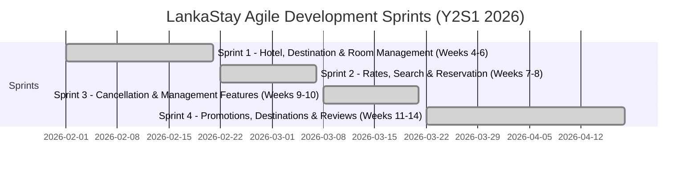
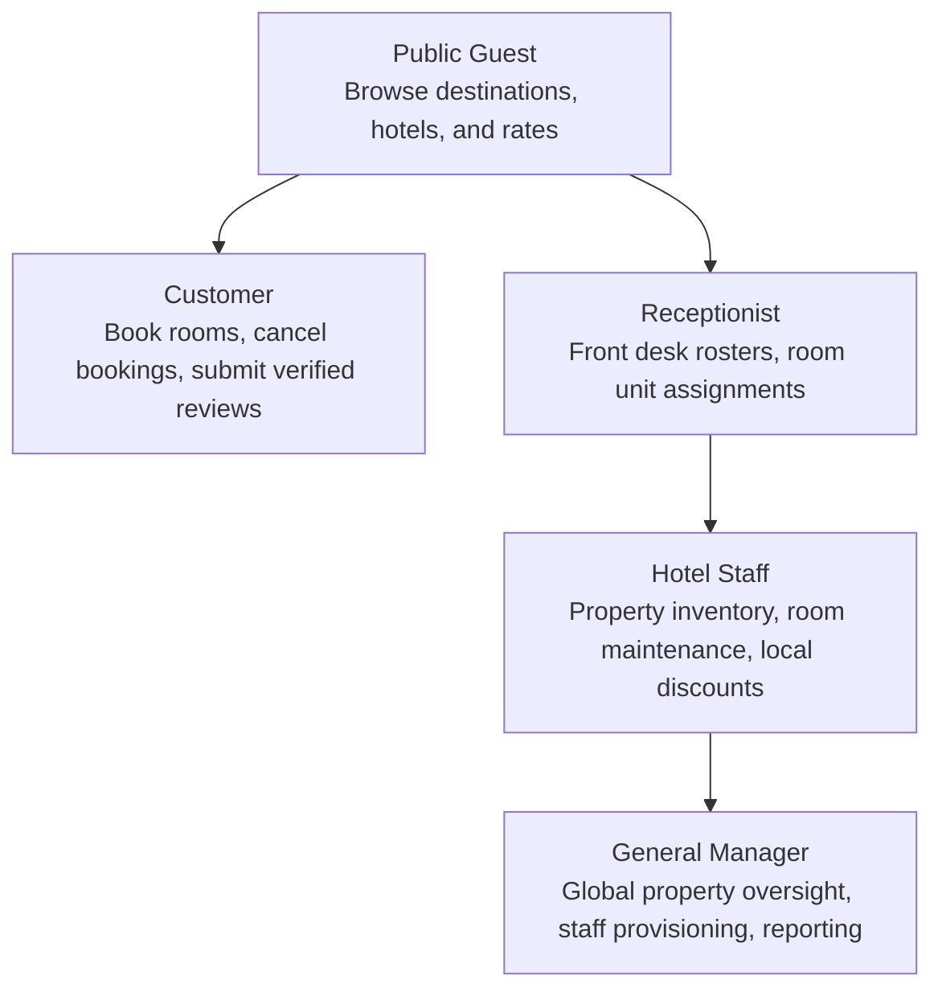

# LankaStay Hotels & Resorts – Multi-Property Hotel Reservation System
[](https://github.com/mln414/hotel-reservation-system/actions/workflows/backend-ci.yml)
[](https://github.com/mln414/hotel-reservation-system/actions/workflows/frontend-ci.yml)
[](https://adoptium.net)
[](https://spring.io/projects/spring-boot)
[](https://react.dev)
[](https://dev.mysql.com)

> **Academic Group Project Declaration**  
> **Institution:** Sri Lanka Institute of Information Technology (SLIIT)  
> **Course Module:** SE2030 – Software Engineering (Year 2, Semester 1 — 2026)  
> **Project Group:** `Y2-S1-MLB-B1G1-07`  
> **Domain:** Enterprise Web-Based Multi-Property Hospitality & Hotel Reservation Platform  

---

## 1. Project Overview

**LankaStay Hotels & Resorts** is a full-stack hospitality web platform engineered collaboratively by our software engineering project group for luxury destination resorts across Sri Lanka. The platform bridges the guest booking journey with comprehensive back-office hotel management:

- **For International Travelers & Guests:** Intuitive destination discovery with interactive maps, curated local attractions, real-time room availability, server-authoritative pricing with seasonal discounts, verified-stay guest reviews, and self-service reservation management.
- **For Hotel Staff & Administration:** A multi-property management portal supporting physical room inventory allocation, maintenance blocking, seasonal promotional offers, guest check-in/out rosters, review moderation, and role-based staff provisioning.

---

## 2. Project Team & Module Ownership

This system was designed, developed, and tested following Agile Scrum methodologies across four dedicated development sprints:

| Student ID | Member Name | GitHub | Assigned Module & Functional Ownership |
|:---:|---|:---:|---|
| **IT25102064** | **Wickramasinghe G.D.M.H** | [@mln414](https://github.com/mln414) | **Destination Management:** Travel destinations catalog, nearby tourist attractions & experiences, interactive Leaflet map integration, destination image galleries, and active/inactive availability controls. |
| **IT25101220** | **Lakshan H.M.K** | [@LakshanHMK](https://github.com/LakshanHMK) | **Search, Reservation & Cancellation:** Accommodation search by travel dates and guest count, real-time availability checking, database pessimistic write locking (`SELECT ... FOR UPDATE`), reservation itemization, and cancellation workflows. |
| **IT25300115** | **Wickramasinghe M.P.T.H** | [@thinuraWiC](https://github.com/thinuraWiC) | **Hotel Management:** Hotel profile management, unique property ID assignment, hotel-to-destination mapping, structured policy records (JSON), and media storage service. |
| **IT25300345** | **Hansani J.A.T.H** | [@thimasha70](https://github.com/thimasha70) | **Room & Amenity Management:** Room catalog, room categories, amenity definitions, duplicate room number validation within properties, physical room unit inventory, and maintenance blocking. |
| **IT25102219** | **Wickrama W.M.K.E** | [@wickrama824](https://github.com/wickrama824) | **Room Rate & Promotion (Discount) Management:** Dynamic seasonal room rates for travel periods, promotional discount codes, validity periods, usage limit controls, and promotion eligibility rules. |
| **IT25103014** | **Weerarathna N.H** | [@heshan0815](https://github.com/heshan0815) | **Review Management:** Verified-stay review submission (strictly gated to completed stays, max 1 review per stay), multi-criteria ratings aggregation, official management replies, and administrator moderation. |

---

## 3. Agile Development Sprints Summary

The 24-item product backlog was prioritized and delivered across four development sprints:



- **Sprint 1 (Weeks 4–6) — Hotel, Destination and Room Management:**  
  Established foundational entities: hotel profiles, destination creation, hotel-to-destination assignment, room catalog, room amenities, and duplicate room number validation within properties.
- **Sprint 2 (Weeks 7–8) — Rates, Search and Reservation:**  
  Implemented seasonal room rates, accommodation search by dates and guest count, real-time availability checking with concurrency handling, and reservation booking.
- **Sprint 3 (Weeks 9–10) — Cancellation and Management Features:**  
  Reservation cancellation retaining historical records, property deactivation toggles, hotel updates, and promotional codes with defined validity periods.
- **Sprint 4 (Weeks 11–14) — Promotions, Destinations and Reviews:**  
  Promotional discount eligibility rules, destination images and nearby attractions curation, verified-stay guest reviews, administrator review moderation, and full system integration.

---

## 4. Key System Features

- 🗺️ **Geographic Destination Discovery:** Search travel hubs across Sri Lanka with Leaflet map coordinates and curated attraction guides.
- 🏨 **Multi-Property Showcase:** Hotel catalog with high-resolution photography, property amenities, and custom hotel policies.
- 🔒 **Zero Double-Booking Guarantee:** Real-time concurrency protection via database-level pessimistic write locking (`PESSIMISTIC_WRITE`).
- 💰 **Server-Authoritative Pricing:** Tamper-proof calculations where nightly subtotals, seasonal discounts, promotional codes, and taxes are computed strictly on the backend.
- 🛡️ **Verified-Stay Guest Reviews:** Anti-fraud reviews strictly gated to guests who completed their stay, with a strict 1-review-per-stay policy.
- 🛏️ **Physical Unit Inventory Control:** Front-desk physical room allocation (`Room 101`, `102`), room status toggling, and scheduled maintenance blocking.
- 👥 **Role-Based Access Control (RBAC):** Access tiers for Public Guests, Registered Customers, Receptionists, Hotel Staff, and General Managers.
- 🖼️ **Secure Media Uploads:** TwelveMonkeys WebP image optimization with magic-byte deep inspection against malicious file uploads.

---

## 5. User Roles & Access Hierarchy



---

## 6. Technology Stack

### Backend Tier
- **Language & Runtime:** Java 25+ (LTS)
- **Framework:** Spring Boot 4.1.0 with Spring MVC & Spring Security
- **Data Persistence:** Spring Data JPA, Hibernate ORM, Spring `JdbcTemplate`
- **Database Engine:** MySQL 8.0+
- **Schema Management:** Flyway Migrations (sequential V1 through V19 + baseline B18)
- **Image Processing:** TwelveMonkeys ImageIO (WebP conversion)
- **Build Tool:** Apache Maven 3.9+ (wrapper included)

### Frontend Tier
- **Framework:** React 19 + Vite 8
- **Routing:** React Router 8
- **Design System:** Custom Luxury Vanilla CSS design system with HSL tokens
- **Interactive Maps:** Leaflet 1.9 & React-Leaflet 5.0
- **Icons:** Lucide React
- **Code Quality:** Oxlint

---

## 7. Quick Start Guide

Follow these simple steps to run the complete LankaStay platform locally on your machine.

### Prerequisites

| Software | Minimum Version | Check Command |
|---|---|---|
| **Java JDK** | 17 or higher | `java -version` |
| **Node.js** | 22.22 or higher | `node -v` |
| **MySQL Server** | 8.0 or higher | `mysql --version` |
| **Git** | Recent version | `git --version` |

---

### Step 1: Clone the Repository
```bash
git clone https://github.com/mln414/hotel-reservation-system.git
cd hotel-reservation-system
```

---

### Step 2: Set Up MySQL Database
Open your MySQL CLI or MySQL Workbench and run:

```sql
-- 1. Create database
CREATE DATABASE lankastay_db CHARACTER SET utf8mb4 COLLATE utf8mb4_unicode_ci;

-- 2. Create application user
CREATE USER 'lankastay_app'@'localhost' IDENTIFIED BY 'LankaStay@Secure2026!';

-- 3. Grant privileges
GRANT ALL PRIVILEGES ON lankastay_db.* TO 'lankastay_app'@'localhost';
FLUSH PRIVILEGES;
```

---

### Step 3: Configure Environment Variables
Copy the example environment configuration:

```powershell
# Windows PowerShell:
Copy-Item .env.example .env

# macOS / Linux:
cp .env.example .env
```

Open `.env` in your text editor and ensure the database credentials match your local MySQL configuration:
```env
DB_HOST=localhost
DB_PORT=3306
DB_NAME=lankastay_db
DB_USER=lankastay_app
DB_PASSWORD=LankaStay@Secure2026!

# Initial bootstrap manager account
INITIAL_MANAGER_EMAIL=admin@lankastay.local
INITIAL_MANAGER_PASSWORD=Admin@LankaStay2026!
```

---

### Step 4: Start the Backend Server

You can launch the backend using either the one-click PowerShell launcher or Maven:

**Option A — PowerShell Launcher (Recommended on Windows):**
```powershell
.\start-backend.ps1
```

**Option B — Using Maven Wrapper:**
```powershell
cd backend
.\mvnw.cmd spring-boot:run
```
*(On macOS / Linux: `cd backend && ./mvnw spring-boot:run`)*

- The backend will start on **`http://localhost:8080`**.
- Flyway automatically applies all database migrations on first startup.

---

### Step 5: Start the Frontend Application

Open a **new terminal window** and run:

**Option A — PowerShell Launcher:**
```powershell
.\start-frontend.ps1
```

**Option B — Using npm directly:**
```powershell
cd frontend
npm install
npm run dev
```

- The React SPA will open at **`http://localhost:5174`** (or `http://localhost:5173`).

---

## 8. Default Demo Accounts

For assessment and testing, the application can be accessed using the following pre-configured credentials:

| Role | Portal URL | Username / Email | Temporary Password | Note |
|---|---|---|---|---|
| **General Manager** | `/management/login` | `admin@lankastay.local` | `Admin@LankaStay2026!` | Requires password change on 1st login |
| **Hotel Staff** | `/management/login` | `staff.galle@lankastay.local` | `Staff@Galle2026!` | Assigned to Galle property |
| **Receptionist** | `/management/login` | `reception.kandy@lankastay.local` | `Recept@Kandy2026!` | Assigned to Kandy property |
| **Customer** | `/login` | `customer.demo@lankastay.local` | `Customer@2026!` | Has completed stays for reviews |

*New customers can also self-register at any time via `/register`.*

---

## 9. Database Migrations (Flyway V1 – V19)

The project uses Flyway for reproducible, automated database migrations across all team members' workstations:

| Migration | Domain / Purpose |
|---|---|
| `V1__dashboard_authentication.sql` | Staff accounts, RBAC roles (`MANAGER`, `HOTEL_STAFF`, `RECEPTIONIST`), audit log |
| `V2__hotel_management.sql` | Hotel entities, amenities, photos, and policies |
| `V3__customer_and_password_reset.sql` | Customer users, profiles, SHA-256 password reset tokens |
| `V4__hotel_contact_fields.sql` | Extended contact information, phone, email, and location coordinates |
| `V5__reservation_core.sql` | Core reservation schema, booking numbers, dates, pricing breakdowns |
| `V6__room_management_core.sql` | Room types, rates constraints, room gallery images |
| `V7__rate_and_offer_management.sql` | Seasonal rates and promotional marketing packages |
| `V8__review_management.sql` | Verified-stay guest reviews and official staff replies |
| `V9__customer_profile_audit.sql` | Security audit event enhancements |
| `V10__review_submission_history.sql` | 1-review-per-stay constraint tracking |
| `V11__physical_room_inventory.sql` | Physical room units (`Room 101`, `102`) and maintenance blocks |
| `V12__reservation_physical_room_assignments.sql` | Reservation to physical room unit assignments |
| `V13__complete_existing_hotel_inventory.sql` | Complete physical room inventory across properties |
| `V14__restore_existing_hotel_photos.sql` | High-resolution property photography |
| `V15__publish_three_booking_ready_hotels.sql` | Showcase hotels across Galle, Colombo, and Kandy |
| `V16__restore_discount_table.sql` | Promotional coupon codes and discount engine |
| `V17__align_discount_value_type.sql` | Decimal precision alignment for discounts |
| `V18__destination_management.sql` | Sri Lanka travel destination and attraction catalog |
| `V19__customer_session_version.sql` | Customer session versioning for immediate invalidation upon password reset |
| `B18__fresh_install_schema.sql` | Consolidated baseline schema for new development environments |

---

## 10. Key REST API Endpoints

| Area | Method | Endpoint | Access Scope | Description |
|---|---|---|---|---|
| **Public** | `GET` | `/api/public/hotels` | Public | Search and filter published hotels |
| **Public** | `GET` | `/api/destinations` | Public | Explore travel destinations & attractions |
| **Public** | `GET` | `/api/public/reviews` | Public | View approved guest reviews & ratings |
| **Customer** | `POST` | `/api/v1/customer/auth/login` | Public | Authenticate customer session |
| **Customer** | `POST` | `/api/v1/customer/reservations` | Customer | Book room with pessimistic concurrency lock |
| **Customer** | `GET` | `/api/v1/customer/reservations` | Customer | List authenticated guest's reservations |
| **Customer** | `POST` | `/api/v1/customer/reviews` | Customer | Submit verified review for completed stay |
| **Staff** | `POST` | `/api/v1/auth/login` | Public | Authenticate staff member session |
| **Staff** | `GET` | `/api/v1/management/rooms` | Staff | Manage rooms for assigned property |
| **Staff** | `POST` | `/api/v1/management/physical-rooms/block` | Staff | Place physical room under maintenance |
| **Management** | `GET` | `/api/v1/management/dashboard` | Manager | Fetch operational KPIs & revenue metrics |
| **Management** | `POST` | `/api/v1/management/staff` | Manager | Provision new staff accounts |

*For complete API documentation, headers, and request/response payloads, see [docs/api/API_OVERVIEW.md](docs/api/API_OVERVIEW.md).*

---

## 11. Automated Testing & Verification

The project includes automated test suites covering backend business rules and frontend components:

### Run Backend Tests
```powershell
cd backend
.\mvnw.cmd test
```
*Executes 26 unit and integration test suites covering auth, security policies, pessimistic locking, rate calculations, and database migrations.*

### Run Frontend Verification
```powershell
cd frontend
npm run test:security       # CSRF, auth flow & header security tests
npm run test:reservations   # Reservation state transition verification
npm run build               # Verify production build compilation
npm run lint                # Oxlint static code analysis
```

---

## 12. Ethical & Architectural Considerations

Aligned with Section 5 of the project Design Document:
- **Data Privacy & Minimization:** Only essential booking and guest profile data is collected; sensitive credentials and passwords use BCrypt hashing (strength 12) and are never exposed in logs or APIs.
- **User Consent & Transparency:** Clear cancellation policies and pricing breakdown rules are shown before booking confirmation; no deceptive hidden fees.
- **Accessibility & Usability:** Semantic HTML5, accessible form labels, keyboard navigation, and responsive layouts across common desktop and mobile screen sizes.
- **Security & Role Separation:** Five-tier RBAC ensures staff can access only functions authorized for their role and assigned hotel property.
- **Fairness & Integrity in Pricing:** Server-authoritative quoting prevents client tampering; promotional usage limits are strictly enforced.
- **Responsible Review Moderation:** Strictly restricted to completed stays to prevent fraudulent ratings; administrator moderation transparently manages inappropriate content without altering genuine customer feedback.

---

## 13. Academic Declaration & License

This project is submitted in partial fulfillment of the requirements for the **SE2030 Software Engineering** course module at the **Sri Lanka Institute of Information Technology (SLIIT)**.

All rights reserved © 2026 LankaStay Hotels & Resorts Student Project Team (`Y2-S1-MLB-B1G1-07`). Developed solely for academic evaluation and educational purposes.
